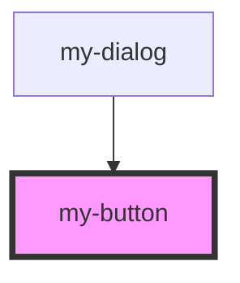

# my-button

<!-- Auto Generated Below -->

## Properties

| Property   | Attribute  | Description | Type                              | Default     |
| ---------- | ---------- | ----------- | --------------------------------- | ----------- |
| `disabled` | `disabled` |             | `boolean`                         | `undefined` |
| `type`     | `type`     |             | `"button" \| "reset" \| "submit"` | `"submit"`  |
| `weight`   | `weight`   |             | `"normal" \| "slim" \| "strong"`  | `"normal"`  |

## Dependencies

### Used by

 - [my-dialog](../my-dialog)

### Graph

----------------------------------------------

*Built with [StencilJS](https://stenciljs.com/)*
